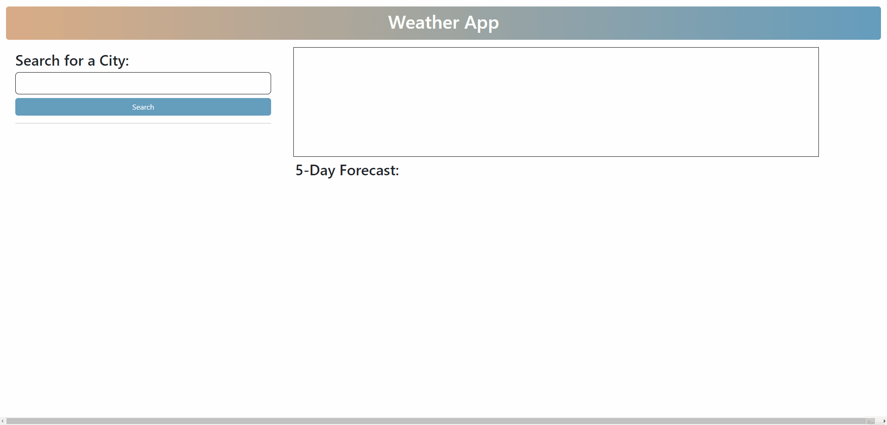

# Weather App

## Description

In this weather app you are able to type in a city name into the search form and click search. It then will present the city name, current date, temperature, wind speed, humidity, and a weather icon representing the weather. It also displays a 5-Day Forecast in which you see small boxes with the weather for the next five days. Every time you enter a city it will be saved into localStorage and will display the city, along with being able to click on any city you have already searched for and it will display that cities weather again.

## Built With

- HTML
- CSS
- JavaScript
- Open Weather APIs
- Bootstrap

## Deployment

## Usage

## Code Source

Got some help from instructor and TA.